# Sibudaya-be Sequence Diagrams

Dokumentasi sequence diagram untuk semua modul di Sibudaya-be backend.

## Table of Contents

### 1. Auth Module

- [1.1 Register User](#11-register-user)
- [1.2 Login (Email/Password)](#12-login-emailpassword)
- [1.3 Google OAuth](#13-google-oauth)
- [1.4 Refresh Token](#14-refresh-token)
- [1.5 Reset Password](#15-reset-password)

### 2. Lembaga Module

- [2.1 Daftar Lembaga Budaya](#21-daftar-lembaga-budaya)
- [2.2 Update Lembaga](#22-update-lembaga)
- [2.3 Upload Sertifikat NIK](#23-upload-sertifikat-nik)

### 3. Pengajuan Module (User)

- [3.1 Submit Pengajuan Pentas](#31-submit-pengajuan-pentas)
- [3.2 Submit Pengajuan Hibah](#32-submit-pengajuan-hibah)
- [3.3 Upload Laporan Kegiatan](#33-upload-laporan-kegiatan)
- [3.4 Revisi Pengajuan](#34-revisi-pengajuan)

### 4. Admin Pengajuan Module

- [4.1 Review Pemeriksaan](#41-review-pemeriksaan)
- [4.2 Survey Lapangan (Hibah)](#42-survey-lapangan-hibah)
- [4.3 Surat Persetujuan](#43-surat-persetujuan)
- [4.4 Review Laporan Kegiatan](#44-review-laporan-kegiatan)
- [4.5 Pencairan Dana (Pentas)](#45-pencairan-dana-pentas)
- [4.6 Pengiriman Sarana (Hibah)](#46-pengiriman-sarana-hibah)

### 5. Admin Fasilitasi Module

- [5.1 Kelola Jenis Fasilitasi](#51-kelola-jenis-fasilitasi)
- [5.2 Kelola Paket Fasilitasi](#52-kelola-paket-fasilitasi)
- [5.3 Upload Template](#53-upload-template)

### 6. Admin Account Module

- [6.1 Kelola Akun Admin](#61-kelola-akun-admin)
- [6.2 Reset Password Admin](#62-reset-password-admin)

### 7. Notifikasi Module

- [7.1 Kirim Notifikasi](#71-kirim-notifikasi)
- [7.2 Baca Notifikasi](#72-baca-notifikasi)

---

## 1. Auth Module

### 1.1 Register User

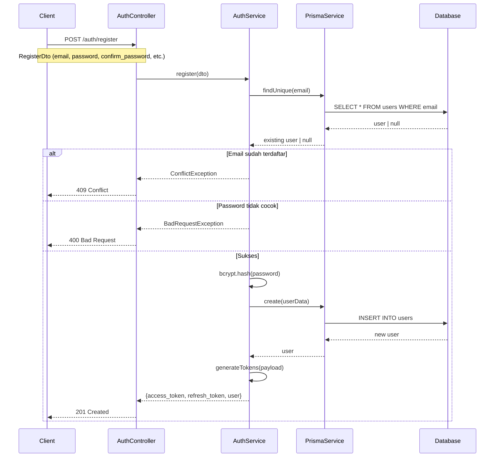
```mermaid
sequenceDiagram
    participant C as Client
    participant AC as AuthController
    participant AS as AuthService
    participant PS as PrismaService
    participant DB as Database

    C->>AC: POST /auth/register
    Note over C,AC: RegisterDto (email, password, confirm_password, etc.)

    AC->>AS: register(dto)
    AS->>PS: findUnique(email)
    PS->>DB: SELECT * FROM users WHERE email
    DB-->>PS: user | null
    PS-->>AS: existing user | null

    alt Email sudah terdaftar
        AS-->>AC: ConflictException
        AC-->>C: 409 Conflict
    else Password tidak cocok
        AS-->>AC: BadRequestException
        AC-->>C: 400 Bad Request
    else Sukses
        AS->>AS: bcrypt.hash(password)
        AS->>PS: create(userData)
        PS->>DB: INSERT INTO users
        DB-->>PS: new user
        PS-->>AS: user
        AS->>AS: generateTokens(payload)
        AS-->>AC: {access_token, refresh_token, user}
        AC-->>C: 201 Created
    end
```

### 1.2 Login (Email/Password)

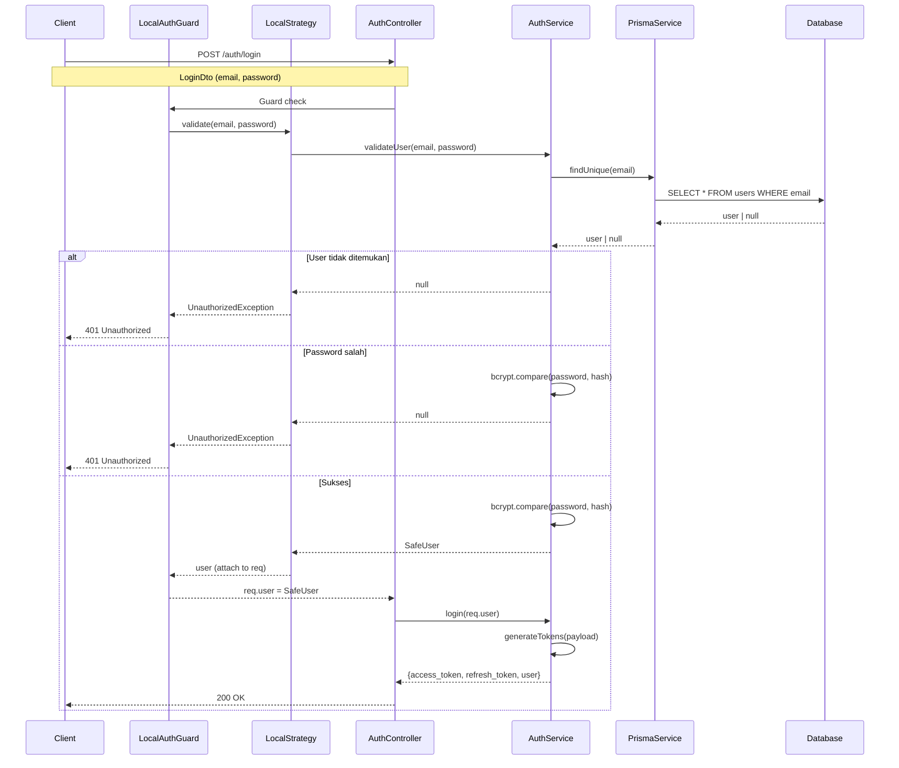
```mermaid
sequenceDiagram
    participant C as Client
    participant LG as LocalAuthGuard
    participant LS as LocalStrategy
    participant AC as AuthController
    participant AS as AuthService
    participant PS as PrismaService
    participant DB as Database

    C->>AC: POST /auth/login
    Note over C,AC: LoginDto (email, password)

    AC->>LG: Guard check
    LG->>LS: validate(email, password)
    LS->>AS: validateUser(email, password)
    AS->>PS: findUnique(email)
    PS->>DB: SELECT * FROM users WHERE email
    DB-->>PS: user | null
    PS-->>AS: user | null

    alt User tidak ditemukan
        AS-->>LS: null
        LS-->>LG: UnauthorizedException
        LG-->>C: 401 Unauthorized
    else Password salah
        AS->>AS: bcrypt.compare(password, hash)
        AS-->>LS: null
        LS-->>LG: UnauthorizedException
        LG-->>C: 401 Unauthorized
    else Sukses
        AS->>AS: bcrypt.compare(password, hash)
        AS-->>LS: SafeUser
        LS-->>LG: user (attach to req)
        LG-->>AC: req.user = SafeUser
        AC->>AS: login(req.user)
        AS->>AS: generateTokens(payload)
        AS-->>AC: {access_token, refresh_token, user}
        AC-->>C: 200 OK
    end
```

### 1.3 Google OAuth

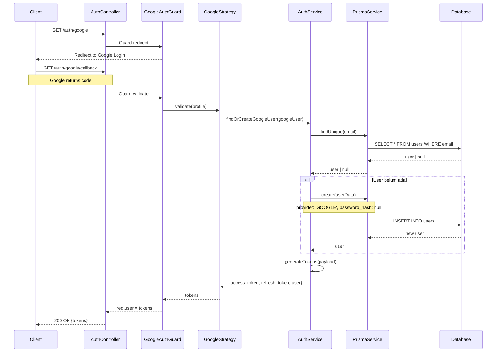
```mermaid
sequenceDiagram
    participant C as Client
    participant AC as AuthController
    participant GG as GoogleAuthGuard
    participant GS as GoogleStrategy
    participant AS as AuthService
    participant PS as PrismaService
    participant DB as Database

    C->>AC: GET /auth/google
    AC->>GG: Guard redirect
    GG-->>C: Redirect to Google Login

    C->>AC: GET /auth/google/callback
    Note over C,AC: Google returns code

    AC->>GG: Guard validate
    GG->>GS: validate(profile)
    GS->>AS: findOrCreateGoogleUser(googleUser)
    AS->>PS: findUnique(email)
    PS->>DB: SELECT * FROM users WHERE email
    DB-->>PS: user | null
    PS-->>AS: user | null

    alt User belum ada
        AS->>PS: create(userData)
        Note over AS,PS: provider: 'GOOGLE', password_hash: null
        PS->>DB: INSERT INTO users
        DB-->>PS: new user
        PS-->>AS: user
    end

    AS->>AS: generateTokens(payload)
    AS-->>GS: {access_token, refresh_token, user}
    GS-->>GG: tokens
    GG-->>AC: req.user = tokens
    AC-->>C: 200 OK {tokens}
```

### 1.4 Refresh Token

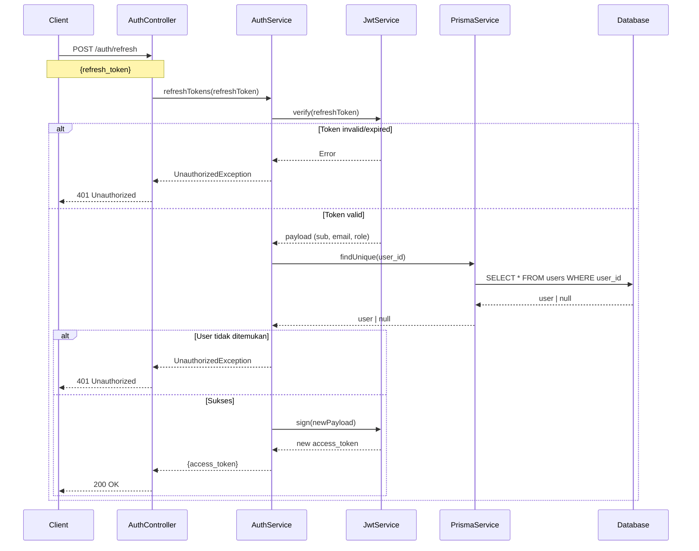
```mermaid
sequenceDiagram
    participant C as Client
    participant AC as AuthController
    participant AS as AuthService
    participant JWT as JwtService
    participant PS as PrismaService
    participant DB as Database

    C->>AC: POST /auth/refresh
    Note over C,AC: {refresh_token}

    AC->>AS: refreshTokens(refreshToken)
    AS->>JWT: verify(refreshToken)

    alt Token invalid/expired
        JWT-->>AS: Error
        AS-->>AC: UnauthorizedException
        AC-->>C: 401 Unauthorized
    else Token valid
        JWT-->>AS: payload (sub, email, role)
        AS->>PS: findUnique(user_id)
        PS->>DB: SELECT * FROM users WHERE user_id
        DB-->>PS: user | null
        PS-->>AS: user | null

        alt User tidak ditemukan
            AS-->>AC: UnauthorizedException
            AC-->>C: 401 Unauthorized
        else Sukses
            AS->>JWT: sign(newPayload)
            JWT-->>AS: new access_token
            AS-->>AC: {access_token}
            AC-->>C: 200 OK
        end
    end
```

### 1.5 Reset Password

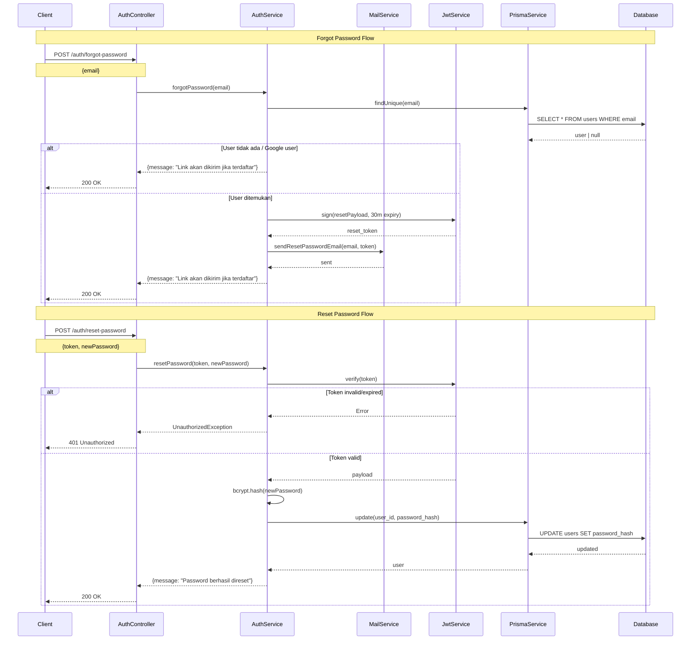
```mermaid
sequenceDiagram
    participant C as Client
    participant AC as AuthController
    participant AS as AuthService
    participant MS as MailService
    participant JWT as JwtService
    participant PS as PrismaService
    participant DB as Database

    Note over C,DB: Forgot Password Flow
    C->>AC: POST /auth/forgot-password
    Note over C,AC: {email}

    AC->>AS: forgotPassword(email)
    AS->>PS: findUnique(email)
    PS->>DB: SELECT * FROM users WHERE email
    DB-->>PS: user | null

    alt User tidak ada / Google user
        AS-->>AC: {message: "Link akan dikirim jika terdaftar"}
        AC-->>C: 200 OK
    else User ditemukan
        AS->>JWT: sign(resetPayload, 30m expiry)
        JWT-->>AS: reset_token
        AS->>MS: sendResetPasswordEmail(email, token)
        MS-->>AS: sent
        AS-->>AC: {message: "Link akan dikirim jika terdaftar"}
        AC-->>C: 200 OK
    end

    Note over C,DB: Reset Password Flow
    C->>AC: POST /auth/reset-password
    Note over C,AC: {token, newPassword}

    AC->>AS: resetPassword(token, newPassword)
    AS->>JWT: verify(token)

    alt Token invalid/expired
        JWT-->>AS: Error
        AS-->>AC: UnauthorizedException
        AC-->>C: 401 Unauthorized
    else Token valid
        JWT-->>AS: payload
        AS->>AS: bcrypt.hash(newPassword)
        AS->>PS: update(user_id, password_hash)
        PS->>DB: UPDATE users SET password_hash
        DB-->>PS: updated
        PS-->>AS: user
        AS-->>AC: {message: "Password berhasil direset"}
        AC-->>C: 200 OK
    end
```

---

## 2. Lembaga Module

### 2.1 Daftar Lembaga Budaya

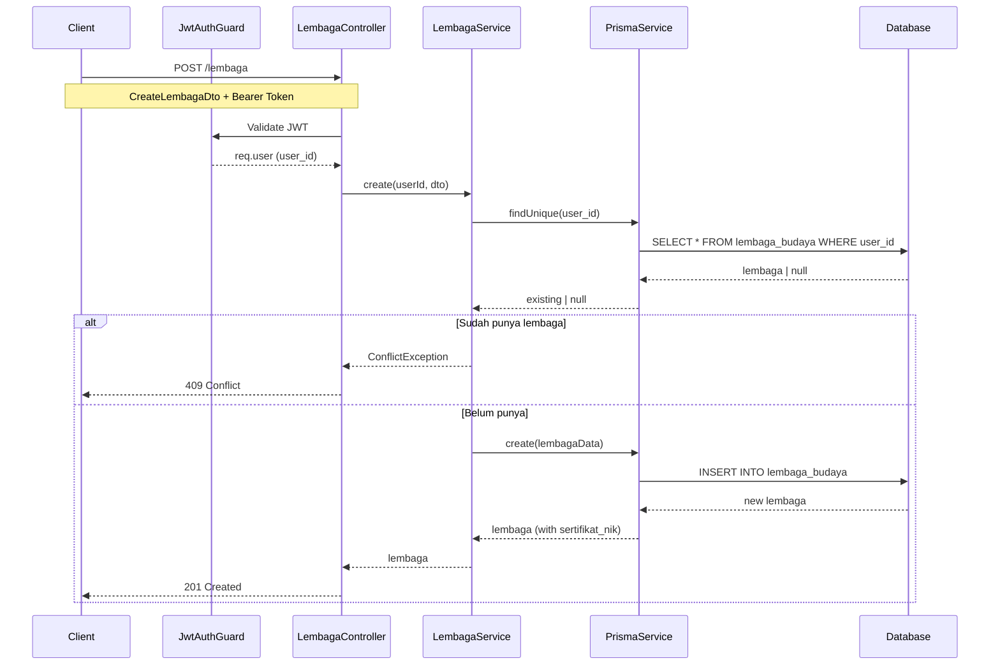
```mermaid
sequenceDiagram
    participant C as Client
    participant JG as JwtAuthGuard
    participant LC as LembagaController
    participant LS as LembagaService
    participant PS as PrismaService
    participant DB as Database

    C->>LC: POST /lembaga
    Note over C,LC: CreateLembagaDto + Bearer Token

    LC->>JG: Validate JWT
    JG-->>LC: req.user (user_id)

    LC->>LS: create(userId, dto)
    LS->>PS: findUnique(user_id)
    PS->>DB: SELECT * FROM lembaga_budaya WHERE user_id
    DB-->>PS: lembaga | null
    PS-->>LS: existing | null

    alt Sudah punya lembaga
        LS-->>LC: ConflictException
        LC-->>C: 409 Conflict
    else Belum punya
        LS->>PS: create(lembagaData)
        PS->>DB: INSERT INTO lembaga_budaya
        DB-->>PS: new lembaga
        PS-->>LS: lembaga (with sertifikat_nik)
        LS-->>LC: lembaga
        LC-->>C: 201 Created
    end
```

### 2.2 Update Lembaga

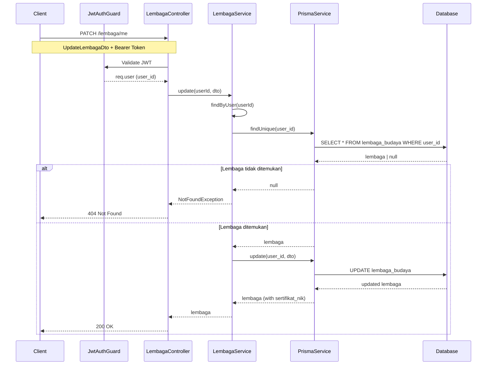
```mermaid
sequenceDiagram
    participant C as Client
    participant JG as JwtAuthGuard
    participant LC as LembagaController
    participant LS as LembagaService
    participant PS as PrismaService
    participant DB as Database

    C->>LC: PATCH /lembaga/me
    Note over C,LC: UpdateLembagaDto + Bearer Token

    LC->>JG: Validate JWT
    JG-->>LC: req.user (user_id)

    LC->>LS: update(userId, dto)
    LS->>LS: findByUser(userId)
    LS->>PS: findUnique(user_id)
    PS->>DB: SELECT * FROM lembaga_budaya WHERE user_id
    DB-->>PS: lembaga | null

    alt Lembaga tidak ditemukan
        PS-->>LS: null
        LS-->>LC: NotFoundException
        LC-->>C: 404 Not Found
    else Lembaga ditemukan
        PS-->>LS: lembaga
        LS->>PS: update(user_id, dto)
        PS->>DB: UPDATE lembaga_budaya
        DB-->>PS: updated lembaga
        PS-->>LS: lembaga (with sertifikat_nik)
        LS-->>LC: lembaga
        LC-->>C: 200 OK
    end
```

### 2.3 Upload Sertifikat NIK

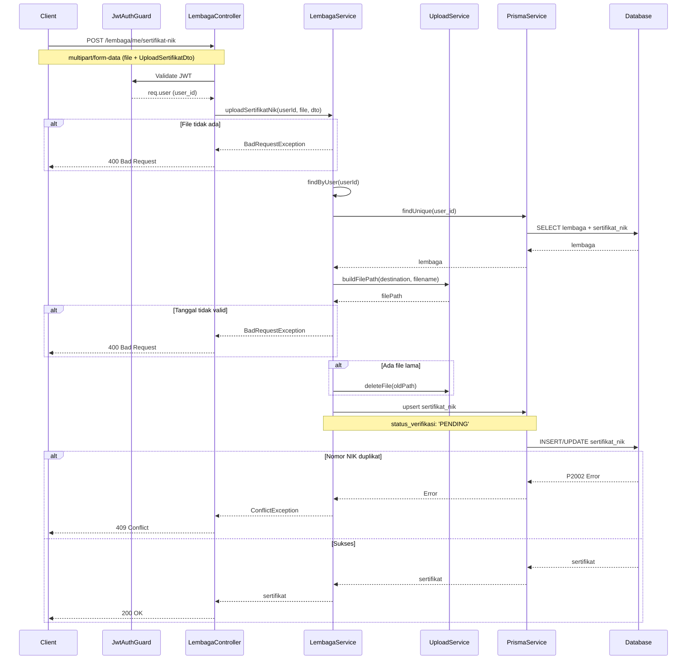
```mermaid
sequenceDiagram
    participant C as Client
    participant JG as JwtAuthGuard
    participant LC as LembagaController
    participant LS as LembagaService
    participant US as UploadService
    participant PS as PrismaService
    participant DB as Database

    C->>LC: POST /lembaga/me/sertifikat-nik
    Note over C,LC: multipart/form-data (file + UploadSertifikatDto)

    LC->>JG: Validate JWT
    JG-->>LC: req.user (user_id)

    LC->>LS: uploadSertifikatNik(userId, file, dto)

    alt File tidak ada
        LS-->>LC: BadRequestException
        LC-->>C: 400 Bad Request
    end

    LS->>LS: findByUser(userId)
    LS->>PS: findUnique(user_id)
    PS->>DB: SELECT lembaga + sertifikat_nik
    DB-->>PS: lembaga
    PS-->>LS: lembaga

    LS->>US: buildFilePath(destination, filename)
    US-->>LS: filePath

    alt Tanggal tidak valid
        LS-->>LC: BadRequestException
        LC-->>C: 400 Bad Request
    end

    alt Ada file lama
        LS->>US: deleteFile(oldPath)
    end

    LS->>PS: upsert sertifikat_nik
    Note over LS,PS: status_verifikasi: 'PENDING'
    PS->>DB: INSERT/UPDATE sertifikat_nik

    alt Nomor NIK duplikat
        DB-->>PS: P2002 Error
        PS-->>LS: Error
        LS-->>LC: ConflictException
        LC-->>C: 409 Conflict
    else Sukses
        DB-->>PS: sertifikat
        PS-->>LS: sertifikat
        LS-->>LC: sertifikat
        LC-->>C: 200 OK
    end
```

---

## 3. Pengajuan Module (User)

### 3.1 Submit Pengajuan Pentas

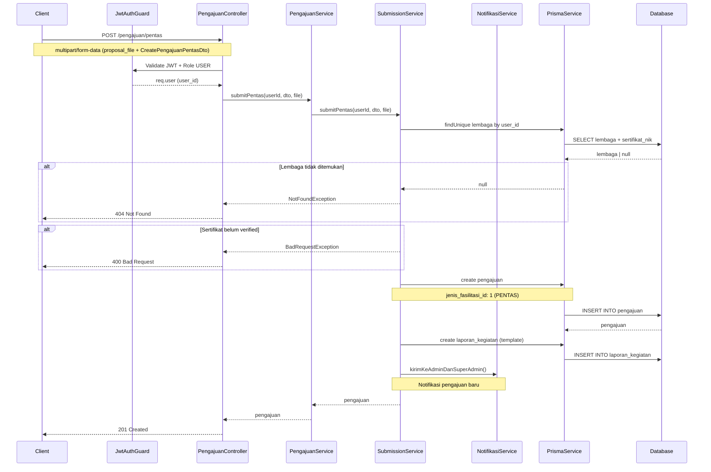
```mermaid
sequenceDiagram
    participant C as Client
    participant JG as JwtAuthGuard
    participant PC as PengajuanController
    participant PS as PengajuanService
    participant SS as SubmissionService
    participant NS as NotifikasiService
    participant PR as PrismaService
    participant DB as Database

    C->>PC: POST /pengajuan/pentas
    Note over C,PC: multipart/form-data (proposal_file + CreatePengajuanPentasDto)

    PC->>JG: Validate JWT + Role USER
    JG-->>PC: req.user (user_id)

    PC->>PS: submitPentas(userId, dto, file)
    PS->>SS: submitPentas(userId, dto, file)

    SS->>PR: findUnique lembaga by user_id
    PR->>DB: SELECT lembaga + sertifikat_nik
    DB-->>PR: lembaga | null

    alt Lembaga tidak ditemukan
        PR-->>SS: null
        SS-->>PC: NotFoundException
        PC-->>C: 404 Not Found
    end

    alt Sertifikat belum verified
        SS-->>PC: BadRequestException
        PC-->>C: 400 Bad Request
    end

    SS->>PR: create pengajuan
    Note over SS,PR: jenis_fasilitasi_id: 1 (PENTAS)
    PR->>DB: INSERT INTO pengajuan
    DB-->>PR: pengajuan

    SS->>PR: create laporan_kegiatan (template)
    PR->>DB: INSERT INTO laporan_kegiatan

    SS->>NS: kirimKeAdminDanSuperAdmin()
    Note over SS,NS: Notifikasi pengajuan baru

    SS-->>PS: pengajuan
    PS-->>PC: pengajuan
    PC-->>C: 201 Created
```

### 3.2 Submit Pengajuan Hibah

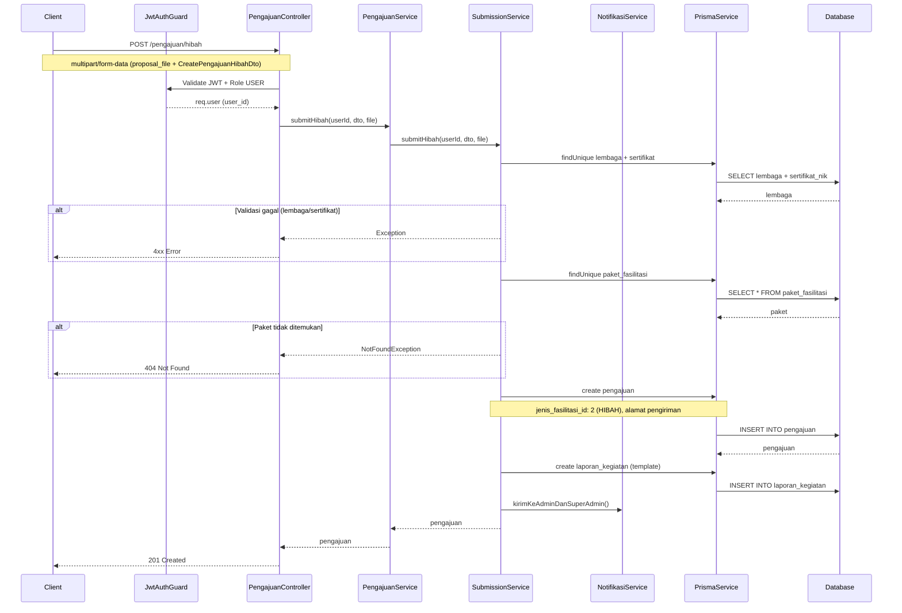
```mermaid
sequenceDiagram
    participant C as Client
    participant JG as JwtAuthGuard
    participant PC as PengajuanController
    participant PS as PengajuanService
    participant SS as SubmissionService
    participant NS as NotifikasiService
    participant PR as PrismaService
    participant DB as Database

    C->>PC: POST /pengajuan/hibah
    Note over C,PC: multipart/form-data (proposal_file + CreatePengajuanHibahDto)

    PC->>JG: Validate JWT + Role USER
    JG-->>PC: req.user (user_id)

    PC->>PS: submitHibah(userId, dto, file)
    PS->>SS: submitHibah(userId, dto, file)

    SS->>PR: findUnique lembaga + sertifikat
    PR->>DB: SELECT lembaga + sertifikat_nik
    DB-->>PR: lembaga

    alt Validasi gagal (lembaga/sertifikat)
        SS-->>PC: Exception
        PC-->>C: 4xx Error
    end

    SS->>PR: findUnique paket_fasilitasi
    PR->>DB: SELECT * FROM paket_fasilitasi
    DB-->>PR: paket

    alt Paket tidak ditemukan
        SS-->>PC: NotFoundException
        PC-->>C: 404 Not Found
    end

    SS->>PR: create pengajuan
    Note over SS,PR: jenis_fasilitasi_id: 2 (HIBAH), alamat pengiriman
    PR->>DB: INSERT INTO pengajuan
    DB-->>PR: pengajuan

    SS->>PR: create laporan_kegiatan (template)
    PR->>DB: INSERT INTO laporan_kegiatan

    SS->>NS: kirimKeAdminDanSuperAdmin()

    SS-->>PS: pengajuan
    PS-->>PC: pengajuan
    PC-->>C: 201 Created
```

### 3.3 Upload Laporan Kegiatan

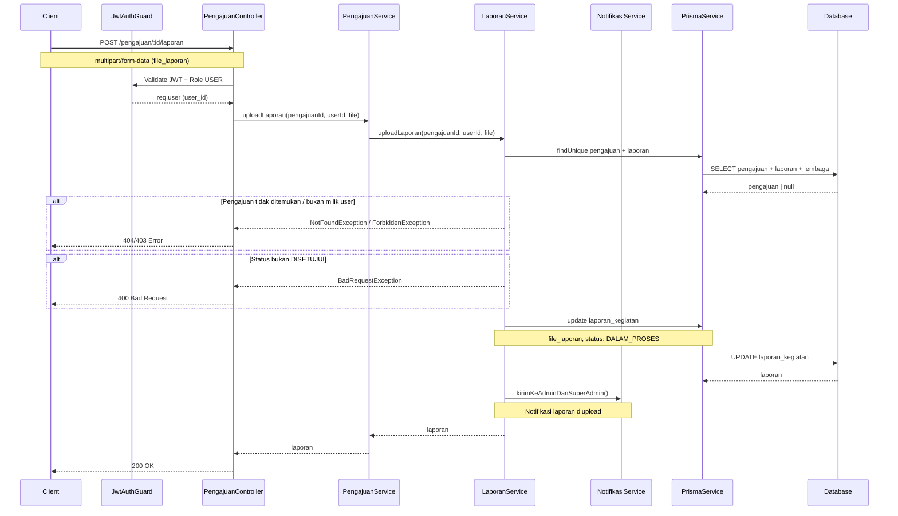
```mermaid
sequenceDiagram
    participant C as Client
    participant JG as JwtAuthGuard
    participant PC as PengajuanController
    participant PS as PengajuanService
    participant LS as LaporanService
    participant NS as NotifikasiService
    participant PR as PrismaService
    participant DB as Database

    C->>PC: POST /pengajuan/:id/laporan
    Note over C,PC: multipart/form-data (file_laporan)

    PC->>JG: Validate JWT + Role USER
    JG-->>PC: req.user (user_id)

    PC->>PS: uploadLaporan(pengajuanId, userId, file)
    PS->>LS: uploadLaporan(pengajuanId, userId, file)

    LS->>PR: findUnique pengajuan + laporan
    PR->>DB: SELECT pengajuan + laporan + lembaga
    DB-->>PR: pengajuan | null

    alt Pengajuan tidak ditemukan / bukan milik user
        LS-->>PC: NotFoundException / ForbiddenException
        PC-->>C: 404/403 Error
    end

    alt Status bukan DISETUJUI
        LS-->>PC: BadRequestException
        PC-->>C: 400 Bad Request
    end

    LS->>PR: update laporan_kegiatan
    Note over LS,PR: file_laporan, status: DALAM_PROSES
    PR->>DB: UPDATE laporan_kegiatan
    DB-->>PR: laporan

    LS->>NS: kirimKeAdminDanSuperAdmin()
    Note over LS,NS: Notifikasi laporan diupload

    LS-->>PS: laporan
    PS-->>PC: laporan
    PC-->>C: 200 OK
```

### 3.4 Revisi Pengajuan

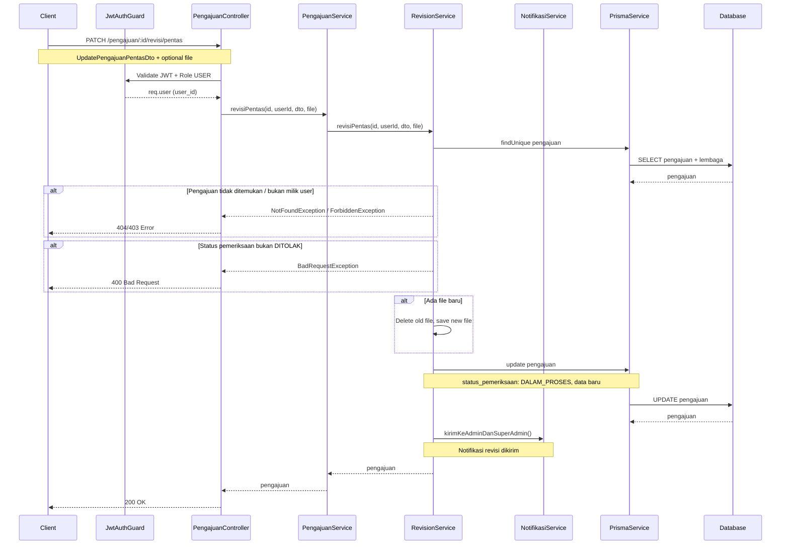
```mermaid
sequenceDiagram
    participant C as Client
    participant JG as JwtAuthGuard
    participant PC as PengajuanController
    participant PS as PengajuanService
    participant RS as RevisionService
    participant NS as NotifikasiService
    participant PR as PrismaService
    participant DB as Database

    C->>PC: PATCH /pengajuan/:id/revisi/pentas
    Note over C,PC: UpdatePengajuanPentasDto + optional file

    PC->>JG: Validate JWT + Role USER
    JG-->>PC: req.user (user_id)

    PC->>PS: revisiPentas(id, userId, dto, file)
    PS->>RS: revisiPentas(id, userId, dto, file)

    RS->>PR: findUnique pengajuan
    PR->>DB: SELECT pengajuan + lembaga
    DB-->>PR: pengajuan

    alt Pengajuan tidak ditemukan / bukan milik user
        RS-->>PC: NotFoundException / ForbiddenException
        PC-->>C: 404/403 Error
    end

    alt Status pemeriksaan bukan DITOLAK
        RS-->>PC: BadRequestException
        PC-->>C: 400 Bad Request
    end

    alt Ada file baru
        RS->>RS: Delete old file, save new file
    end

    RS->>PR: update pengajuan
    Note over RS,PR: status_pemeriksaan: DALAM_PROSES, data baru
    PR->>DB: UPDATE pengajuan
    DB-->>PR: pengajuan

    RS->>NS: kirimKeAdminDanSuperAdmin()
    Note over RS,NS: Notifikasi revisi dikirim

    RS-->>PS: pengajuan
    PS-->>PC: pengajuan
    PC-->>C: 200 OK
```

---

## 4. Admin Pengajuan Module

### 4.1 Review Pemeriksaan

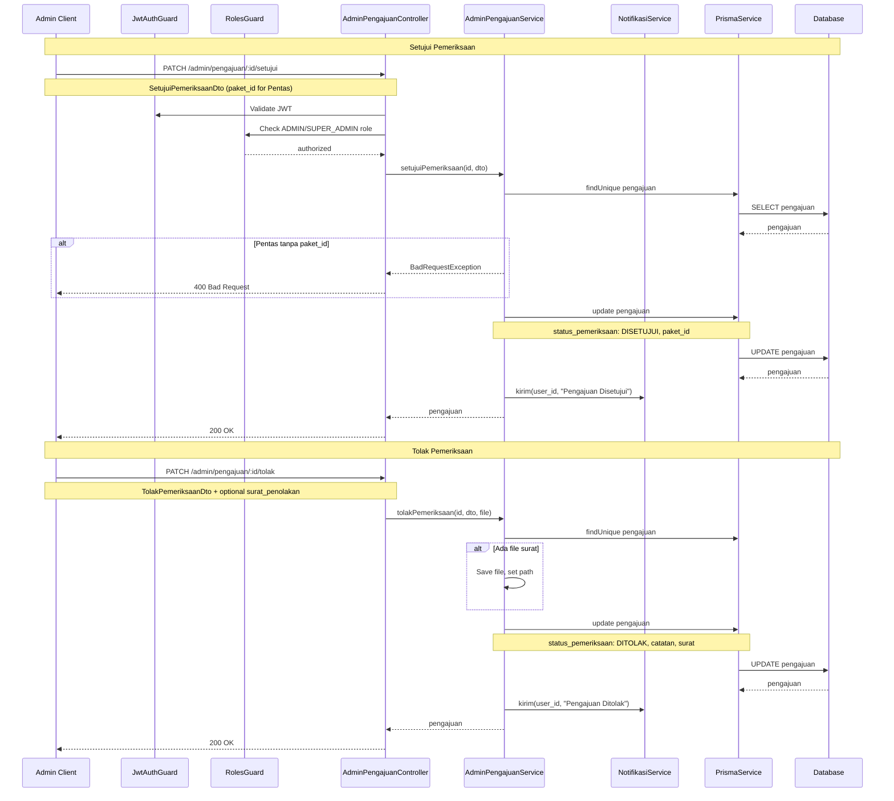
```mermaid
sequenceDiagram
    participant C as Admin Client
    participant JG as JwtAuthGuard
    participant RG as RolesGuard
    participant AC as AdminPengajuanController
    participant AS as AdminPengajuanService
    participant NS as NotifikasiService
    participant PR as PrismaService
    participant DB as Database

    Note over C,DB: Setujui Pemeriksaan
    C->>AC: PATCH /admin/pengajuan/:id/setujui
    Note over C,AC: SetujuiPemeriksaanDto (paket_id for Pentas)

    AC->>JG: Validate JWT
    AC->>RG: Check ADMIN/SUPER_ADMIN role
    RG-->>AC: authorized

    AC->>AS: setujuiPemeriksaan(id, dto)
    AS->>PR: findUnique pengajuan
    PR->>DB: SELECT pengajuan
    DB-->>PR: pengajuan

    alt Pentas tanpa paket_id
        AS-->>AC: BadRequestException
        AC-->>C: 400 Bad Request
    end

    AS->>PR: update pengajuan
    Note over AS,PR: status_pemeriksaan: DISETUJUI, paket_id
    PR->>DB: UPDATE pengajuan
    DB-->>PR: pengajuan

    AS->>NS: kirim(user_id, "Pengajuan Disetujui")

    AS-->>AC: pengajuan
    AC-->>C: 200 OK

    Note over C,DB: Tolak Pemeriksaan
    C->>AC: PATCH /admin/pengajuan/:id/tolak
    Note over C,AC: TolakPemeriksaanDto + optional surat_penolakan

    AC->>AS: tolakPemeriksaan(id, dto, file)
    AS->>PR: findUnique pengajuan

    alt Ada file surat
        AS->>AS: Save file, set path
    end

    AS->>PR: update pengajuan
    Note over AS,PR: status_pemeriksaan: DITOLAK, catatan, surat
    PR->>DB: UPDATE pengajuan
    DB-->>PR: pengajuan

    AS->>NS: kirim(user_id, "Pengajuan Ditolak")

    AS-->>AC: pengajuan
    AC-->>C: 200 OK
```

### 4.2 Survey Lapangan (Hibah)

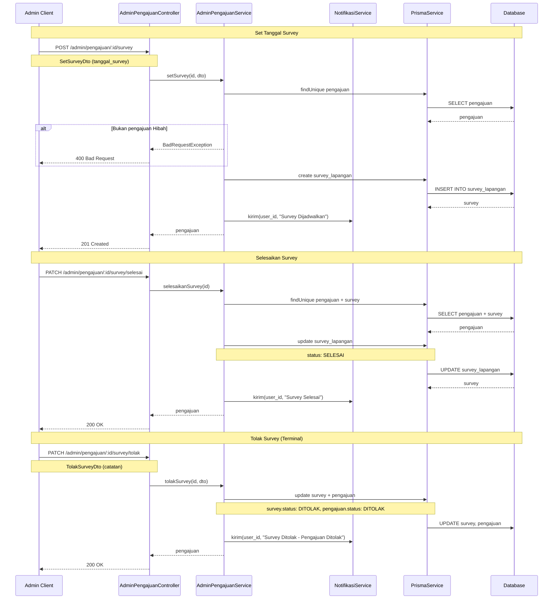
```mermaid
sequenceDiagram
    participant C as Admin Client
    participant AC as AdminPengajuanController
    participant AS as AdminPengajuanService
    participant NS as NotifikasiService
    participant PR as PrismaService
    participant DB as Database

    Note over C,DB: Set Tanggal Survey
    C->>AC: POST /admin/pengajuan/:id/survey
    Note over C,AC: SetSurveyDto (tanggal_survey)

    AC->>AS: setSurvey(id, dto)
    AS->>PR: findUnique pengajuan
    PR->>DB: SELECT pengajuan
    DB-->>PR: pengajuan

    alt Bukan pengajuan Hibah
        AS-->>AC: BadRequestException
        AC-->>C: 400 Bad Request
    end

    AS->>PR: create survey_lapangan
    PR->>DB: INSERT INTO survey_lapangan
    DB-->>PR: survey

    AS->>NS: kirim(user_id, "Survey Dijadwalkan")

    AS-->>AC: pengajuan
    AC-->>C: 201 Created

    Note over C,DB: Selesaikan Survey
    C->>AC: PATCH /admin/pengajuan/:id/survey/selesai

    AC->>AS: selesaikanSurvey(id)
    AS->>PR: findUnique pengajuan + survey
    PR->>DB: SELECT pengajuan + survey
    DB-->>PR: pengajuan

    AS->>PR: update survey_lapangan
    Note over AS,PR: status: SELESAI
    PR->>DB: UPDATE survey_lapangan
    DB-->>PR: survey

    AS->>NS: kirim(user_id, "Survey Selesai")

    AS-->>AC: pengajuan
    AC-->>C: 200 OK

    Note over C,DB: Tolak Survey (Terminal)
    C->>AC: PATCH /admin/pengajuan/:id/survey/tolak
    Note over C,AC: TolakSurveyDto (catatan)

    AC->>AS: tolakSurvey(id, dto)
    AS->>PR: update survey + pengajuan
    Note over AS,PR: survey.status: DITOLAK, pengajuan.status: DITOLAK
    PR->>DB: UPDATE survey, pengajuan

    AS->>NS: kirim(user_id, "Survey Ditolak - Pengajuan Ditolak")

    AS-->>AC: pengajuan
    AC-->>C: 200 OK
```

### 4.3 Surat Persetujuan

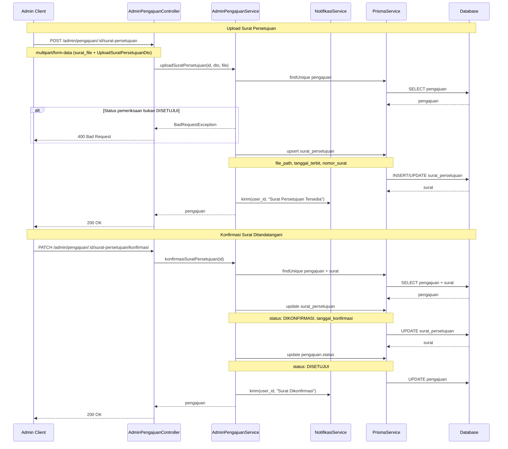
```mermaid
sequenceDiagram
    participant C as Admin Client
    participant AC as AdminPengajuanController
    participant AS as AdminPengajuanService
    participant NS as NotifikasiService
    participant PR as PrismaService
    participant DB as Database

    Note over C,DB: Upload Surat Persetujuan
    C->>AC: POST /admin/pengajuan/:id/surat-persetujuan
    Note over C,AC: multipart/form-data (surat_file + UploadSuratPersetujuanDto)

    AC->>AS: uploadSuratPersetujuan(id, dto, file)
    AS->>PR: findUnique pengajuan
    PR->>DB: SELECT pengajuan
    DB-->>PR: pengajuan

    alt Status pemeriksaan bukan DISETUJUI
        AS-->>AC: BadRequestException
        AC-->>C: 400 Bad Request
    end

    AS->>PR: upsert surat_persetujuan
    Note over AS,PR: file_path, tanggal_terbit, nomor_surat
    PR->>DB: INSERT/UPDATE surat_persetujuan
    DB-->>PR: surat

    AS->>NS: kirim(user_id, "Surat Persetujuan Tersedia")

    AS-->>AC: pengajuan
    AC-->>C: 200 OK

    Note over C,DB: Konfirmasi Surat Ditandatangani
    C->>AC: PATCH /admin/pengajuan/:id/surat-persetujuan/konfirmasi

    AC->>AS: konfirmasiSuratPersetujuan(id)
    AS->>PR: findUnique pengajuan + surat
    PR->>DB: SELECT pengajuan + surat
    DB-->>PR: pengajuan

    AS->>PR: update surat_persetujuan
    Note over AS,PR: status: DIKONFIRMASI, tanggal_konfirmasi
    PR->>DB: UPDATE surat_persetujuan
    DB-->>PR: surat

    AS->>PR: update pengajuan.status
    Note over AS,PR: status: DISETUJUI
    PR->>DB: UPDATE pengajuan

    AS->>NS: kirim(user_id, "Surat Dikonfirmasi")

    AS-->>AC: pengajuan
    AC-->>C: 200 OK
```

### 4.4 Review Laporan Kegiatan

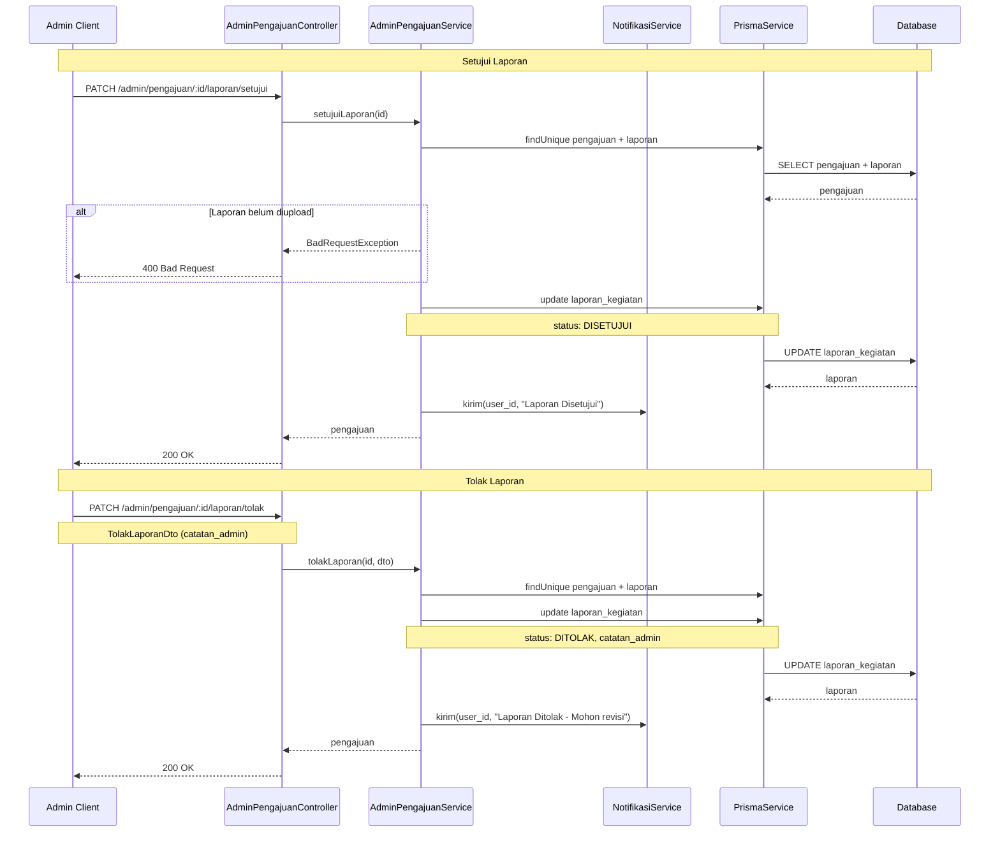
```mermaid
sequenceDiagram
    participant C as Admin Client
    participant AC as AdminPengajuanController
    participant AS as AdminPengajuanService
    participant NS as NotifikasiService
    participant PR as PrismaService
    participant DB as Database

    Note over C,DB: Setujui Laporan
    C->>AC: PATCH /admin/pengajuan/:id/laporan/setujui

    AC->>AS: setujuiLaporan(id)
    AS->>PR: findUnique pengajuan + laporan
    PR->>DB: SELECT pengajuan + laporan
    DB-->>PR: pengajuan

    alt Laporan belum diupload
        AS-->>AC: BadRequestException
        AC-->>C: 400 Bad Request
    end

    AS->>PR: update laporan_kegiatan
    Note over AS,PR: status: DISETUJUI
    PR->>DB: UPDATE laporan_kegiatan
    DB-->>PR: laporan

    AS->>NS: kirim(user_id, "Laporan Disetujui")

    AS-->>AC: pengajuan
    AC-->>C: 200 OK

    Note over C,DB: Tolak Laporan
    C->>AC: PATCH /admin/pengajuan/:id/laporan/tolak
    Note over C,AC: TolakLaporanDto (catatan_admin)

    AC->>AS: tolakLaporan(id, dto)
    AS->>PR: findUnique pengajuan + laporan

    AS->>PR: update laporan_kegiatan
    Note over AS,PR: status: DITOLAK, catatan_admin
    PR->>DB: UPDATE laporan_kegiatan
    DB-->>PR: laporan

    AS->>NS: kirim(user_id, "Laporan Ditolak - Mohon revisi")

    AS-->>AC: pengajuan
    AC-->>C: 200 OK
```

### 4.5 Pencairan Dana (Pentas)

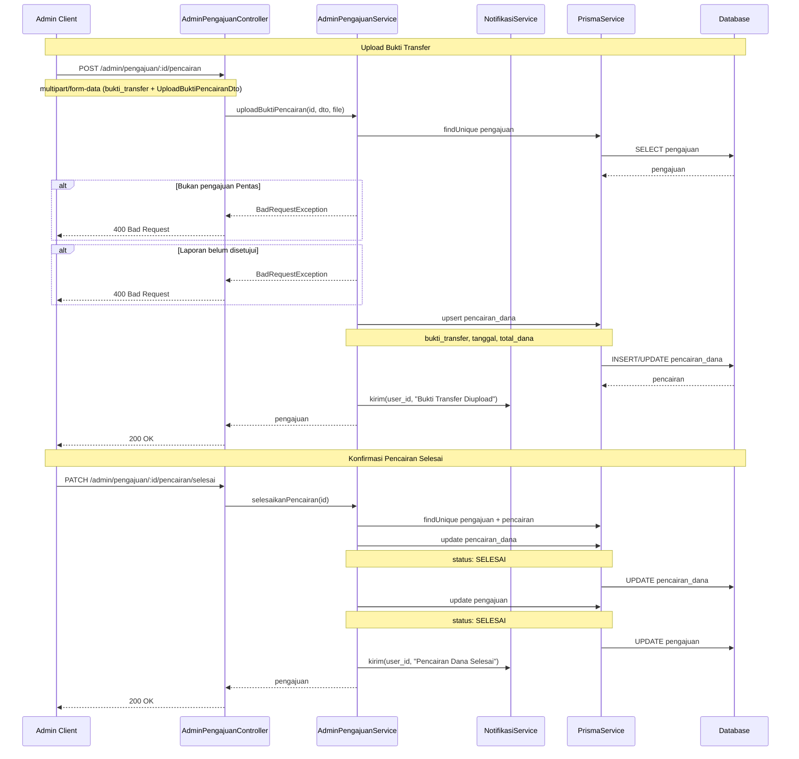
```mermaid
sequenceDiagram
    participant C as Admin Client
    participant AC as AdminPengajuanController
    participant AS as AdminPengajuanService
    participant NS as NotifikasiService
    participant PR as PrismaService
    participant DB as Database

    Note over C,DB: Upload Bukti Transfer
    C->>AC: POST /admin/pengajuan/:id/pencairan
    Note over C,AC: multipart/form-data (bukti_transfer + UploadBuktiPencairanDto)

    AC->>AS: uploadBuktiPencairan(id, dto, file)
    AS->>PR: findUnique pengajuan
    PR->>DB: SELECT pengajuan
    DB-->>PR: pengajuan

    alt Bukan pengajuan Pentas
        AS-->>AC: BadRequestException
        AC-->>C: 400 Bad Request
    end

    alt Laporan belum disetujui
        AS-->>AC: BadRequestException
        AC-->>C: 400 Bad Request
    end

    AS->>PR: upsert pencairan_dana
    Note over AS,PR: bukti_transfer, tanggal, total_dana
    PR->>DB: INSERT/UPDATE pencairan_dana
    DB-->>PR: pencairan

    AS->>NS: kirim(user_id, "Bukti Transfer Diupload")

    AS-->>AC: pengajuan
    AC-->>C: 200 OK

    Note over C,DB: Konfirmasi Pencairan Selesai
    C->>AC: PATCH /admin/pengajuan/:id/pencairan/selesai

    AC->>AS: selesaikanPencairan(id)
    AS->>PR: findUnique pengajuan + pencairan

    AS->>PR: update pencairan_dana
    Note over AS,PR: status: SELESAI
    PR->>DB: UPDATE pencairan_dana

    AS->>PR: update pengajuan
    Note over AS,PR: status: SELESAI
    PR->>DB: UPDATE pengajuan

    AS->>NS: kirim(user_id, "Pencairan Dana Selesai")

    AS-->>AC: pengajuan
    AC-->>C: 200 OK
```

### 4.6 Pengiriman Sarana (Hibah)

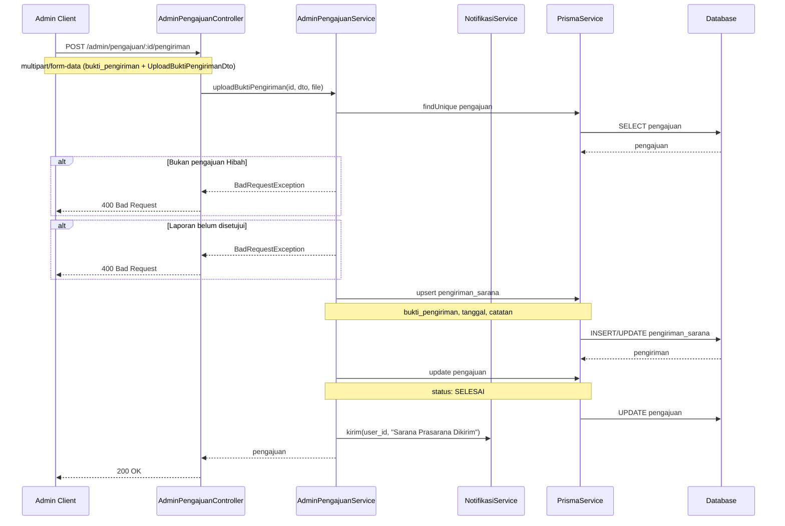
```mermaid
sequenceDiagram
    participant C as Admin Client
    participant AC as AdminPengajuanController
    participant AS as AdminPengajuanService
    participant NS as NotifikasiService
    participant PR as PrismaService
    participant DB as Database

    C->>AC: POST /admin/pengajuan/:id/pengiriman
    Note over C,AC: multipart/form-data (bukti_pengiriman + UploadBuktiPengirimanDto)

    AC->>AS: uploadBuktiPengiriman(id, dto, file)
    AS->>PR: findUnique pengajuan
    PR->>DB: SELECT pengajuan
    DB-->>PR: pengajuan

    alt Bukan pengajuan Hibah
        AS-->>AC: BadRequestException
        AC-->>C: 400 Bad Request
    end

    alt Laporan belum disetujui
        AS-->>AC: BadRequestException
        AC-->>C: 400 Bad Request
    end

    AS->>PR: upsert pengiriman_sarana
    Note over AS,PR: bukti_pengiriman, tanggal, catatan
    PR->>DB: INSERT/UPDATE pengiriman_sarana
    DB-->>PR: pengiriman

    AS->>PR: update pengajuan
    Note over AS,PR: status: SELESAI
    PR->>DB: UPDATE pengajuan

    AS->>NS: kirim(user_id, "Sarana Prasarana Dikirim")

    AS-->>AC: pengajuan
    AC-->>C: 200 OK
```

---

## 5. Admin Fasilitasi Module

### 5.1 Kelola Jenis Fasilitasi

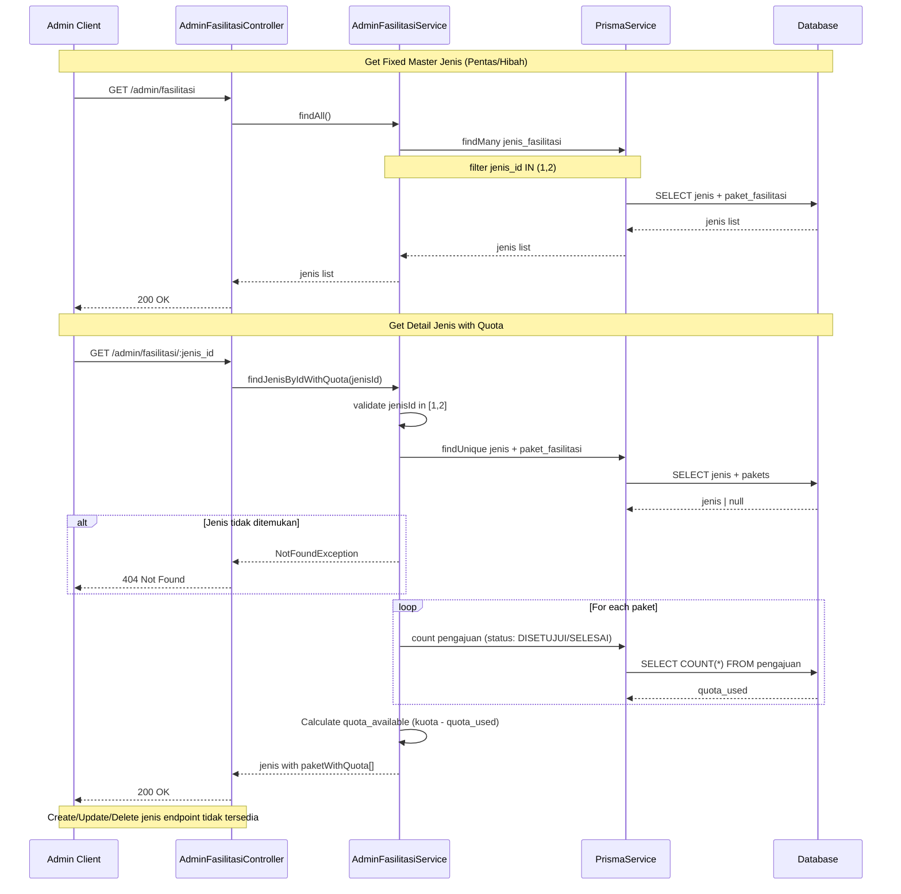
```mermaid
sequenceDiagram
    participant C as Admin Client
    participant AC as AdminFasilitasiController
    participant AS as AdminFasilitasiService
    participant PR as PrismaService
    participant DB as Database

    Note over C,DB: Get Fixed Master Jenis (Pentas/Hibah)
    C->>AC: GET /admin/fasilitasi
    AC->>AS: findAll()
    AS->>PR: findMany jenis_fasilitasi
    Note over AS,PR: filter jenis_id IN (1,2)
    PR->>DB: SELECT jenis + paket_fasilitasi
    DB-->>PR: jenis list
    PR-->>AS: jenis list
    AS-->>AC: jenis list
    AC-->>C: 200 OK

    Note over C,DB: Get Detail Jenis with Quota
    C->>AC: GET /admin/fasilitasi/:jenis_id

    AC->>AS: findJenisByIdWithQuota(jenisId)
    AS->>AS: validate jenisId in [1,2]
    AS->>PR: findUnique jenis + paket_fasilitasi
    PR->>DB: SELECT jenis + pakets
    DB-->>PR: jenis | null

    alt Jenis tidak ditemukan
        AS-->>AC: NotFoundException
        AC-->>C: 404 Not Found
    end

    loop For each paket
        AS->>PR: count pengajuan (status: DISETUJUI/SELESAI)
        PR->>DB: SELECT COUNT(*) FROM pengajuan
        DB-->>PR: quota_used
    end

    AS->>AS: Calculate quota_available (kuota - quota_used)
    AS-->>AC: jenis with paketWithQuota[]
    AC-->>C: 200 OK

    Note over C,AC: Create/Update/Delete jenis endpoint tidak tersedia
```

### 5.2 Kelola Paket Fasilitasi

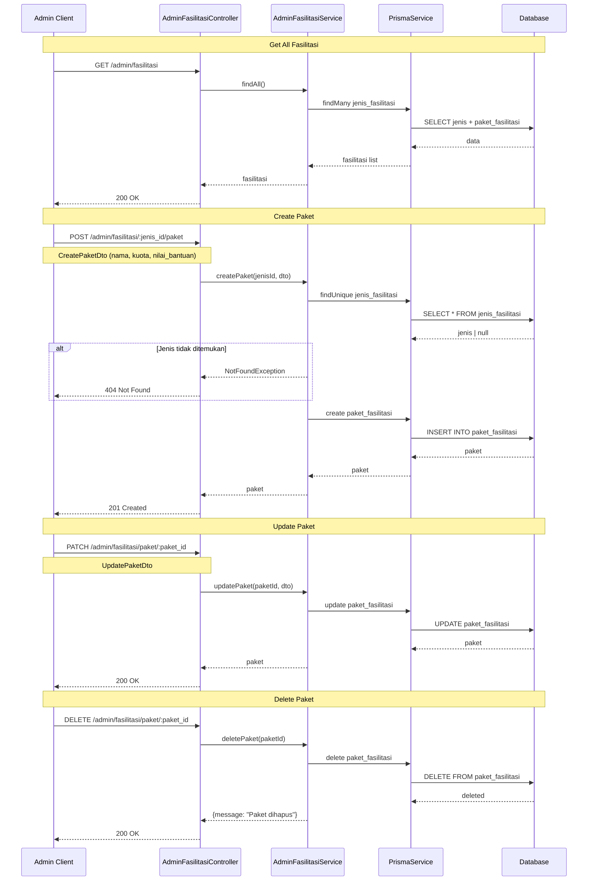
```mermaid
sequenceDiagram
    participant C as Admin Client
    participant AC as AdminFasilitasiController
    participant AS as AdminFasilitasiService
    participant PR as PrismaService
    participant DB as Database

    Note over C,DB: Get All Fasilitasi
    C->>AC: GET /admin/fasilitasi
    AC->>AS: findAll()
    AS->>PR: findMany jenis_fasilitasi
    PR->>DB: SELECT jenis + paket_fasilitasi
    DB-->>PR: data
    PR-->>AS: fasilitasi list
    AS-->>AC: fasilitasi
    AC-->>C: 200 OK

    Note over C,DB: Create Paket
    C->>AC: POST /admin/fasilitasi/:jenis_id/paket
    Note over C,AC: CreatePaketDto (nama, kuota, nilai_bantuan)

    AC->>AS: createPaket(jenisId, dto)
    AS->>PR: findUnique jenis_fasilitasi
    PR->>DB: SELECT * FROM jenis_fasilitasi
    DB-->>PR: jenis | null

    alt Jenis tidak ditemukan
        AS-->>AC: NotFoundException
        AC-->>C: 404 Not Found
    end

    AS->>PR: create paket_fasilitasi
    PR->>DB: INSERT INTO paket_fasilitasi
    DB-->>PR: paket
    PR-->>AS: paket
    AS-->>AC: paket
    AC-->>C: 201 Created

    Note over C,DB: Update Paket
    C->>AC: PATCH /admin/fasilitasi/paket/:paket_id
    Note over C,AC: UpdatePaketDto

    AC->>AS: updatePaket(paketId, dto)
    AS->>PR: update paket_fasilitasi
    PR->>DB: UPDATE paket_fasilitasi
    DB-->>PR: paket
    AS-->>AC: paket
    AC-->>C: 200 OK

    Note over C,DB: Delete Paket
    C->>AC: DELETE /admin/fasilitasi/paket/:paket_id

    AC->>AS: deletePaket(paketId)
    AS->>PR: delete paket_fasilitasi
    PR->>DB: DELETE FROM paket_fasilitasi
    DB-->>PR: deleted
    AS-->>AC: {message: "Paket dihapus"}
    AC-->>C: 200 OK
```

### 5.3 Upload Template

```mermaid
sequenceDiagram
    participant C as Admin Client
    participant AC as AdminFasilitasiController
    participant AS as AdminFasilitasiService
    participant US as UploadService
    participant PR as PrismaService
    participant DB as Database

    C->>AC: POST /admin/fasilitasi/:jenis_id/template/proposal
    Note over C,AC: multipart/form-data (file)

    AC->>AS: uploadTemplate(jenisId, 'proposal', file)

    alt File tidak ada
        AS-->>AC: BadRequestException
        AC-->>C: 400 Bad Request
    end

    AS->>PR: findUnique jenis_fasilitasi
    PR->>DB: SELECT * FROM jenis_fasilitasi
    DB-->>PR: jenis | null

    alt Jenis tidak ditemukan
        AS-->>AC: NotFoundException
        AC-->>C: 404 Not Found
    end

    alt Ada file lama
        AS->>US: deleteFile(oldPath)
    end

    AS->>US: buildFilePath(destination, filename)
    US-->>AS: newPath

    AS->>PR: update jenis_fasilitasi
    Note over AS,PR: template_proposal_file: newPath
    PR->>DB: UPDATE jenis_fasilitasi
    DB-->>PR: jenis
    PR-->>AS: jenis
    AS-->>AC: jenis
    AC-->>C: 200 OK
```

---

## 6. Admin Account Module

### 6.1 Kelola Akun Admin

```mermaid
sequenceDiagram
    participant C as Super Admin Client
    participant JG as JwtAuthGuard
    participant RG as RolesGuard
    participant AC as AdminAccountController
    participant AS as AdminAccountService
    participant PR as PrismaService
    participant DB as Database

    Note over C,DB: Get All Admins
    C->>AC: GET /admin/pengaturan-akun/admins
    AC->>JG: Validate JWT
    AC->>RG: Check SUPER_ADMIN role
    RG-->>AC: authorized

    AC->>AS: findAllAdmins()
    AS->>PR: findMany users (role: ADMIN)
    PR->>DB: SELECT * FROM users WHERE role = 'ADMIN'
    DB-->>PR: admins
    PR-->>AS: admins (tanpa password_hash)
    AS-->>AC: admins
    AC-->>C: 200 OK

    Note over C,DB: Create Admin
    C->>AC: POST /admin/pengaturan-akun/admins
    Note over C,AC: CreateAdminAccountDto (email, first_name, last_name)

    AC->>AS: createAdmin(dto)
    AS->>PR: findUnique(email)
    PR->>DB: SELECT * FROM users WHERE email
    DB-->>PR: user | null

    alt Email sudah ada
        AS-->>AC: ConflictException
        AC-->>C: 409 Conflict
    end

    AS->>AS: bcrypt.hash(DEFAULT_PASSWORD)
    AS->>PR: create user
    Note over AS,PR: role: ADMIN, provider: LOCAL
    PR->>DB: INSERT INTO users
    DB-->>PR: admin
    PR-->>AS: admin (tanpa password_hash)
    AS-->>AC: admin
    AC-->>C: 201 Created

    Note over C,DB: Update Admin
    C->>AC: PATCH /admin/pengaturan-akun/admins/:user_id
    Note over C,AC: UpdateAdminAccountDto

    AC->>AS: updateAdmin(userId, dto)
    AS->>PR: findUnique(user_id, role: ADMIN)

    alt Admin tidak ditemukan
        AS-->>AC: NotFoundException
        AC-->>C: 404 Not Found
    end

    AS->>PR: update user
    PR->>DB: UPDATE users
    DB-->>PR: admin
    AS-->>AC: admin
    AC-->>C: 200 OK

    Note over C,DB: Delete Admin
    C->>AC: DELETE /admin/pengaturan-akun/admins/:user_id

    AC->>AS: deleteAdmin(userId)
    AS->>PR: delete user
    PR->>DB: DELETE FROM users WHERE user_id AND role = 'ADMIN'
    DB-->>PR: deleted
    AS-->>AC: {message: "Admin dihapus"}
    AC-->>C: 200 OK
```

### 6.2 Reset Password Admin

```mermaid
sequenceDiagram
    participant C as Super Admin Client
    participant AC as AdminAccountController
    participant AS as AdminAccountService
    participant CF as ConfigService
    participant PR as PrismaService
    participant DB as Database

    C->>AC: PATCH /admin/pengaturan-akun/admins/:user_id/reset-password

    AC->>AS: resetAdminPassword(userId)
    AS->>PR: findUnique(user_id, role: ADMIN)
    PR->>DB: SELECT * FROM users
    DB-->>PR: admin | null

    alt Admin tidak ditemukan
        AS-->>AC: NotFoundException
        AC-->>C: 404 Not Found
    end

    AS->>CF: get(ADMIN_DEFAULT_PASSWORD)
    CF-->>AS: defaultPassword

    AS->>AS: bcrypt.hash(defaultPassword)

    AS->>PR: update user
    Note over AS,PR: password_hash: hashed default password
    PR->>DB: UPDATE users SET password_hash
    DB-->>PR: admin
    PR-->>AS: admin
    AS-->>AC: {message: "Password berhasil direset"}
    AC-->>C: 200 OK
```

---

## 7. Notifikasi Module

### 7.1 Kirim Notifikasi

```mermaid
sequenceDiagram
    participant Sys as System/Service
    participant NS as NotifikasiService
    participant PR as PrismaService
    participant DB as Database

    Note over Sys,DB: Kirim ke User Spesifik
    Sys->>NS: kirim(userId, judul, pesan)
    NS->>PR: create notifikasi
    PR->>DB: INSERT INTO notifikasi
    DB-->>PR: notifikasi
    PR-->>NS: notifikasi
    NS-->>Sys: notifikasi

    Note over Sys,DB: Kirim ke Admin & Super Admin
    Sys->>NS: kirimKeAdminDanSuperAdmin(judul, pesan, dariUserId)

    opt dariUserId provided
        NS->>NS: resolveUserDisplayName(dariUserId)
        NS->>PR: findUnique user
        PR->>DB: SELECT first_name, last_name, email
        DB-->>PR: user
        PR-->>NS: user
        NS->>NS: Format judul & pesan with sender name
    end

    NS->>PR: findMany users (role in ADMIN, SUPER_ADMIN)
    PR->>DB: SELECT user_id FROM users WHERE role IN (...)
    DB-->>PR: target users
    PR-->>NS: targets

    NS->>PR: createMany notifikasi
    Note over NS,PR: One notification per target user
    PR->>DB: INSERT INTO notifikasi (batch)
    DB-->>PR: count
    PR-->>NS: created
    NS-->>Sys: void
```

### 7.2 Baca Notifikasi

```mermaid
sequenceDiagram
    participant C as Client
    participant JG as JwtAuthGuard
    participant NC as NotifikasiController
    participant NS as NotifikasiService
    participant PR as PrismaService
    participant DB as Database

    Note over C,DB: Get My Notifications
    C->>NC: GET /notifikasi
    NC->>JG: Validate JWT
    JG-->>NC: req.user (user_id)

    NC->>NS: findByUser(userId)
    NS->>PR: findMany notifikasi
    PR->>DB: SELECT * FROM notifikasi WHERE user_id ORDER BY created_at DESC
    DB-->>PR: notifikasi[]
    PR-->>NS: notifikasi[]

    alt Tidak ada notifikasi
        NS-->>NC: {message: "Tidak ada notifikasi", data: []}
    else Ada notifikasi
        NS-->>NC: {total, data: notifikasi[]}
    end
    NC-->>C: 200 OK

    Note over C,DB: Baca Satu Notifikasi
    C->>NC: PATCH /notifikasi/:id/baca
    NC->>JG: Validate JWT
    JG-->>NC: req.user (user_id)

    NC->>NS: bacaNotifikasi(notifikasiId, userId)
    NS->>PR: updateMany
    Note over NS,PR: WHERE notifikasi_id AND user_id
    PR->>DB: UPDATE notifikasi SET status_baca = true
    DB-->>PR: count
    PR-->>NS: {count}
    NS-->>NC: {count}
    NC-->>C: 200 OK

    Note over C,DB: Baca Semua Notifikasi
    C->>NC: PATCH /notifikasi/baca-semua
    NC->>JG: Validate JWT
    JG-->>NC: req.user (user_id)

    NC->>NS: bacaSemua(userId)
    NS->>PR: updateMany
    Note over NS,PR: WHERE user_id AND status_baca = false
    PR->>DB: UPDATE notifikasi SET status_baca = true
    DB-->>PR: count
    PR-->>NS: {count}
    NS-->>NC: {count}
    NC-->>C: 200 OK
```

---

## Legend

| Symbol        | Meaning                      |
| ------------- | ---------------------------- |
| `C`           | Client (Frontend/Mobile App) |
| `JG`          | JwtAuthGuard                 |
| `RG`          | RolesGuard                   |
| `*Controller` | NestJS Controller            |
| `*Service`    | NestJS Service               |
| `PR/PS`       | PrismaService                |
| `DB`          | PostgreSQL Database          |
| `NS`          | NotifikasiService            |
| `US`          | UploadService                |
| `MS`          | MailService                  |
| `JWT`         | JwtService                   |
| `CF`          | ConfigService                |

## Status Values

### Pengajuan Status

- `DALAM_PROSES` - Sedang diproses
- `DISETUJUI` - Disetujui
- `DITOLAK` - Ditolak
- `SELESAI` - Selesai
- `DIBATALKAN` - Dibatalkan oleh user

### Status Pemeriksaan

- `DALAM_PROSES` - Menunggu pemeriksaan
- `DISETUJUI` - Pemeriksaan disetujui
- `DITOLAK` - Pemeriksaan ditolak

### Status Verifikasi (Sertifikat NIK)

- `PENDING` - Menunggu verifikasi
- `VERIFIED` - Terverifikasi
- `REJECTED` - Ditolak
